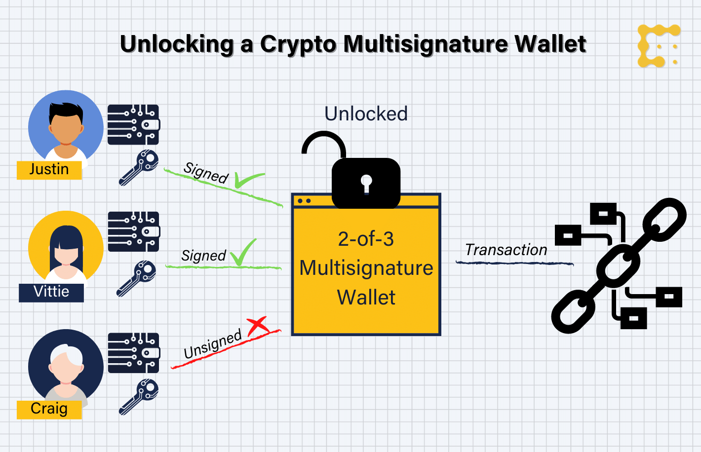

# Multi Signature Ethereum Wallet

## About The Project

Ethereum wallets are cryptocurrency wallets used on the Ethereum Blockchain to store digital assets/tokens, providing
the ability to transfer assets/tokens from one wallet to another.

This project details a Multi-sig wallet smart contract, which is a programmatic solution to the debatable insecurities
surrounding an Ethereum wallet. The smart contract ensures that a transaction between the wallet and the target
Ethereum account, can only be done once consensus has been reached by the multiple owners. This means that a
transaction from the wallet is only valid once multiple people confirm the funds can be transferred.

## Multi Signature wallet

## Built With

* [Solidity 0.5.11](https://docs.soliditylang.org/en/v0.5.11/)

## Prerequisites

* [Solidity 0.5.11](https://docs.soliditylang.org/en/v0.5.11/)

## License

Distributed under the MIT License. See `LICENSE` for more information.

## Contact

- [Email](mailto:aymerjames@gmail.com)
- [Linkedin](https://uk.linkedin.com/in/jamesaymer)
- [Github](https://github.com/JaymoAymer)

## Acknowledgements

* Tasuku Nakamura

